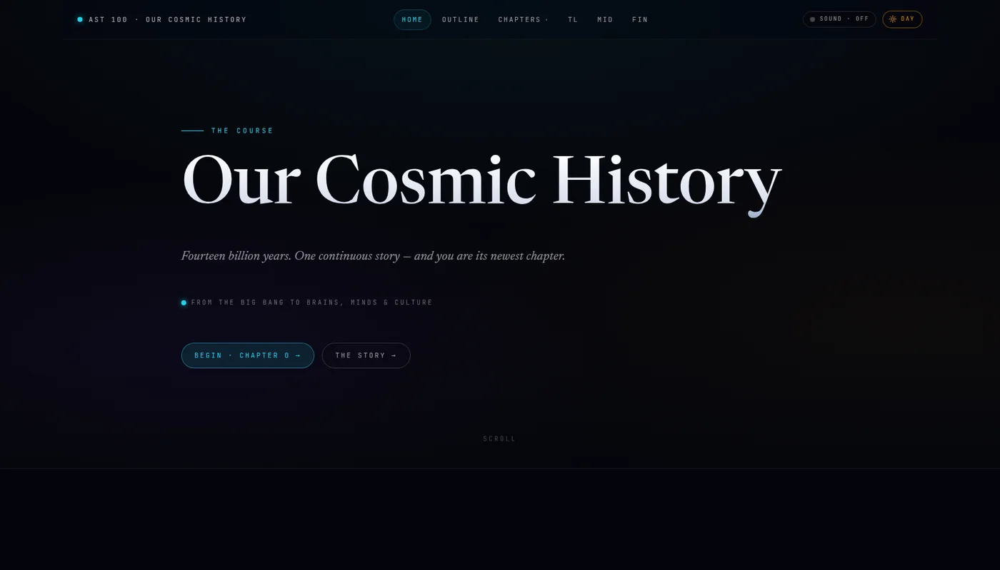
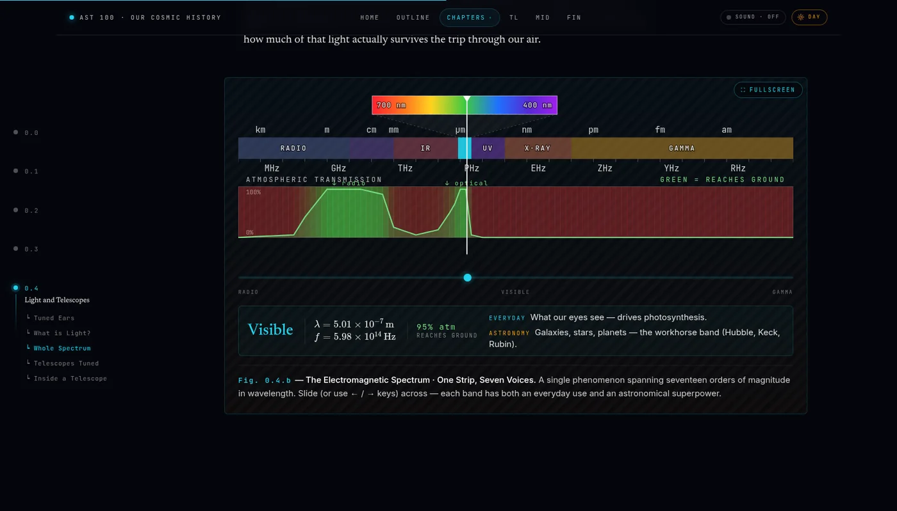
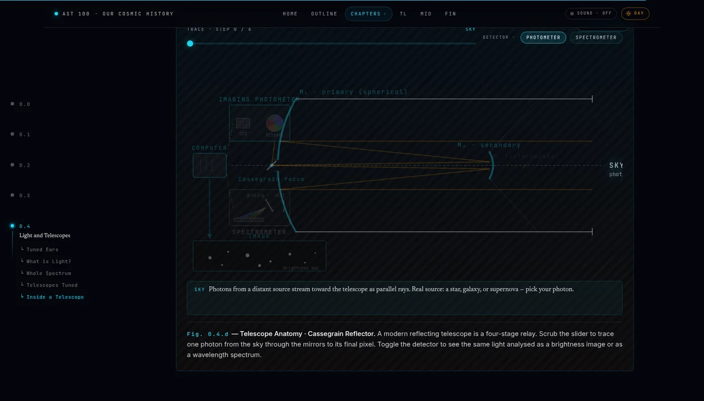

<div align="center">

# AST 100 — Our Cosmic History

**An open project to communicate the whole story of the Universe.**
Fourteen billion years of cosmic evolution — from the Big Bang to galaxies,
stars, planets, life, and culture — turned into rigorous, freely-licensed,
fully interactive science that anyone, anywhere, can read, operate, and reuse.

[](https://cassa.bd/courses/ast100)
[](https://github.com/cassaiub/ast100/actions/workflows/deploy.yml)
[](https://astro.build)
[](https://react.dev)
[](https://tailwindcss.com)
[](https://www.typescriptlang.org)
[](#license)



</div>

---

## Overview

**AST 100 — Our Cosmic History** is an open, public effort to communicate the
science of **cosmic evolution** — the single, unbroken, fourteen-billion-year
story that runs from the first hot instant through galaxies, stars, planets,
life, and human culture — to a general audience anywhere in the world.

It takes the form of a web-native course, taught at **Independent University,
Bangladesh (IUB)**, where students stress-test and validate every lesson, term
after term. But its ambition is larger than any one classroom: to build a
**permanent, openly-licensed library of scientifically rigorous, fully
interactive figures** that any educator, science communicator, or curious
reader can use to explain the big ideas of cosmic history. The course is the
proving ground; the public resource is the goal.

Everything is live and free at
[**cassa.bd/courses/ast100**](https://cassa.bd/courses/ast100), built as a fast,
dependency-light **static site** — Astro 6, React 19, Tailwind CSS v4 — that
ships to production on every push to `main`.

## Why it exists

The story of the Universe is usually kept in separate drawers — physics in one,
chemistry in another, biology and human history in others still. The unifying
insight behind **Big History** and **cosmic evolution** is that there are no
drawers: stars, planets, living cells, thinking minds, and whole civilizations
are chapters of one continuous narrative, each built from the matter and the
lessons of the chapter before.

That story is profoundly worth telling well — it is, in the end, the story of
**our place in the Universe**. Yet most public communication of it is static:
images to look at, videos to watch. This project takes a different position:

> The best way to understand a physical idea is to **operate** it — to move the
> slider, scrub the spectrum, drag through cosmic time — not merely to watch it.

So every concept that warrants a figure gets a **purpose-built interactive**,
grounded in real units and real literature values, never AI-generated artwork.
Because the figures and prose are openly licensed and engineered to be
accessible and embeddable, they are designed to become **genuine, reusable
resources** — building blocks that planetariums, museums, classrooms, and
independent science communicators can adopt and adapt to explain cosmic
evolution to their own audiences. The aim is simple and global: to **raise
public understanding of science and of where we come from.**

## An open, evolving resource

This is a long-lived, openly-licensed public good, not a one-off site.

- **Always open.** Source under MIT, content under CC BY 4.0 — free to use,
  adapt, and build upon, with attribution.
- **Validated by real learners.** Each term the lessons are taught at IUB and
  revised against what actually helps students understand — but the resource is
  written for the public, and its scope is not bounded by the course.
- **It compounds.** The conventions that make each figure rigorous and
  accessible are encoded in a versioned authoring workflow (see below) and
  sharpened term over term, so every cohort's lessons raise the bar for the
  next. The library gets broader and better with time.

## The interactive figure system

The technical heart of the project — and the part most reusable by other
communicators — is a small, shared system that gives every figure the same
first-class behaviour for free.

A shared **`FigureFrame`** wrapper acts as a single, delegated keyboard and
pointer navigator. Any figure placed inside it automatically gains:

- **Keyboard navigation, always** — `←` / `→` step through the figure's state
  (`Shift` for coarse steps), `Esc` exits fullscreen, and single-key shortcuts
  trigger tagged controls.
- **Wheel and trackpad navigation in fullscreen** — so an enlarged figure reads
  as a presentation surface, while the page scrolls normally otherwise.
- **One-gesture fullscreen** — double-click the frame to expand a figure to the
  full viewport, where it re-lays out instead of scaling a tiny canvas.

Individual figures are React islands hydrated on demand and built with
**three.js / react-three-fiber** (3D scenes), **framer-motion** (animation),
and **KaTeX** (mathematics). Because navigation, fullscreen, and theming live in
the shared frame, a figure author can focus purely on the science and the
visualization — which is exactly what makes the figures portable to other
projects.

<div align="center">

&nbsp;

<br>
<sub>The electromagnetic spectrum with atmospheric opacity (left) and a Cassegrain-reflector ray tracer (right) — two of the course's interactive figures.</sub>
</div>

## Principles

- **Interactive, not illustrated.** Bespoke interactives — sliders, scrubbers,
  ray-tracers, 3D scenes — instead of static or AI-generated images.
- **Scientifically rigorous.** Real units (γ, erg g⁻¹ s⁻¹, Mpc, Gyr, M☉),
  values from the literature, and a visible historical anchor (year,
  experiment, or discoverer) wherever one is relevant.
- **Accessible by construction.** Every figure is operable by keyboard alone,
  re-lays out (rather than merely scaling) at fullscreen and on mobile, honours
  light and dark themes, and provides a static fallback under
  `prefers-reduced-motion`.
- **Written for everyone.** Plain-language prose that is self-sufficient on its
  own; the figures are aids, never load-bearing for comprehension.
- **Open and portable.** No server, no database — plain HTML, CSS, and hydrated
  islands that deploy anywhere, under licenses that permit reuse.

## Tech stack

| Concern | Choice |
|---|---|
| Framework | [Astro 6](https://astro.build) — static output, zero JavaScript by default |
| Interactive islands | [React 19](https://react.dev), hydrated on demand |
| Styling | [Tailwind CSS v4](https://tailwindcss.com) — CSS-first, design tokens in an `@theme` block, no config file |
| 3D | [three.js](https://threejs.org) + [react-three-fiber](https://r3f.docs.pmnd.rs) + drei |
| Animation | [framer-motion](https://www.framer.com/motion/) |
| Mathematics | [KaTeX](https://katex.org) |
| Language | [TypeScript](https://www.typescriptlang.org) (`astro/tsconfigs/strict`) |
| Delivery | GitHub Actions → static build → rsync to host |

## Getting started

Requires **Node.js ≥ 22.12**.

```bash
# 1. Clone
git clone https://github.com/cassaiub/ast100.git
cd ast100

# 2. Install dependencies
npm install

# 3. Start the dev server  →  http://localhost:4321/courses/ast100
npm run dev
```

To produce and inspect a production build:

```bash
npm run build     # static output → dist/
npm run preview   # serve the built site locally
```

> The site is served under a base path (`base: '/courses/ast100'`). Never
> hard-code root-absolute URLs — use the helpers in `src/data/course-nav.ts`.

## Project structure

```
ast100/
├── src/
│   ├── pages/
│   │   ├── index.astro                # immersive landing page
│   │   ├── outline.astro              # full course syllabus
│   │   ├── timeline.astro             # 49-event cosmic timeline
│   │   ├── chapter/[num]/index.astro  # chapter cover (a 5-card deck)
│   │   └── chapter/N/N.M.astro        # one self-contained file per lesson
│   ├── components/
│   │   ├── shared/FigureFrame.astro   # the global figure navigator
│   │   └── scenes/N.M/                # Hero, figures, prev/next per lesson
│   ├── data/course-nav.ts             # single source of truth for nav + state
│   ├── layouts/                       # the page shells
│   ├── scripts/                       # runtime polish (fade-up, reading bar…)
│   └── styles/global.css              # Tailwind v4 @theme tokens + design system
├── public/                            # static assets (images, .htaccess)
├── knowledgebase/                     # reference source content (never deployed)
├── .claude/skills/instructor/         # the authoring & review workflow
├── .github/workflows/deploy.yml       # CI: build + rsync on push to main
├── LECTURE-AUTHORING.md               # deep convention reference
└── CLAUDE.md                          # repository guide
```

Each lesson is a **single, self-contained `.astro` file** — prose, headings, and
figure wiring inline — with no content collection and no SSR.
`src/data/course-nav.ts` is the single source of truth that drives navigation,
"coming soon" state, rail anchors, and the chapter-cover cards.

## Course status

The story is structured as seven cosmic ages, each paired with the telescope
that opened it. Chapters **0 and 1 are complete and live**; the remainder are in
active development, term over term.

| Chapter | Age | Lead telescope | Status |
|:---:|---|---|:---:|
| 0 | Seven Ages of the Universe (overview) | — | ✅ Live |
| 1 | Particle Age | Planck | ✅ Live |
| 2 | Galactic Age | Hubble | 🚧 In progress |
| 3 | Stellar Age | Gaia | 🚧 In progress |
| 4 | Planetary Age | Kepler | 🚧 In progress |
| 5 | Chemical Age | ALMA | 🚧 In progress |
| 6 | Biological Age | JWST | 🚧 In progress |
| 7 | Cultural Age | Allen Array | 🚧 In progress |

## Authoring workflow

Lessons are authored and reviewed with **[Claude Code](https://claude.com/claude-code)**
through a versioned project skill, `.claude/skills/instructor/`, that lives in
the repository alongside the code. The skill encodes the project's conventions —
scientific-accuracy rules, the figure DOM contract, the accessibility
non-negotiables, and the plain-language voice — so that every lesson is held to
the same standard and reviewed against the same checklist. As the material is
taught and refined each term, those conventions are sharpened in place, so the
resource improves continuously rather than drifting.

Authoring here is a deliberate, hands-on practice rather than one-off
generation: every lesson and figure is drafted, checked against the science,
stress-tested for accessibility, and revised through many careful iterations
with Claude Code — and the skill that governs them is maintained as rigorously
as the lessons it produces. The conventions are documented in
[`LECTURE-AUTHORING.md`](LECTURE-AUTHORING.md) and [`CLAUDE.md`](CLAUDE.md).

## Deployment

Pushing to `main` triggers [`.github/workflows/deploy.yml`](.github/workflows/deploy.yml),
which runs `npm ci && npm run build` and rsyncs the static `dist/` output to the
production host. **There is no staging environment — a push to `main` is a live
deploy** — so every change is verified locally first (see
[Contributing](#contributing)).

## Contributing & reuse

This is meant to be reused. Educators, science communicators, and developers are
welcome to:

- **Use and adapt the lessons and figures** in their own teaching and outreach,
  under the licenses below.
- **Contribute** corrections, new figures, accessibility improvements, or whole
  lessons, via the standard fork → branch → pull request.

Because there is no staging, please **verify every change locally** before
opening a PR:

```bash
npm run build && npm run preview
```

Then walk the affected pages through each axis:

- **Layout** at the default width, **fullscreen**, and **mobile portrait** (~360px)
- **Both themes** (light and dark)
- **Keyboard only** — every control reachable and operable, including `←` / `→`
- **`prefers-reduced-motion`** — animations replaced by static fallbacks

Project standards for any new figure or lesson:

1. **No AI-generated images.** Replace concept art with a bespoke interactive;
   real photographs and data plots are welcome.
2. **Scientific accuracy first** — real units, real literature values, a
   visible historical anchor where relevant.
3. **Fullscreen-ready, responsive, keyboard-operable, reduced-motion-safe** —
   the figure non-negotiables.
4. **No new dependencies** without discussion first.

See [`LECTURE-AUTHORING.md`](LECTURE-AUTHORING.md) for the full convention
reference.

## License

This project is openly licensed so that the science can travel freely.

- **Code** — the application source, components, and build tooling — is released
  under the [MIT License](LICENSE).
- **Content** — lesson prose, original figures, and course design — is shared
  under
  [Creative Commons Attribution 4.0 International (CC BY 4.0)](https://creativecommons.org/licenses/by/4.0/).

You are free to use, adapt, and build upon both — in a classroom, a planetarium,
a museum, or your own science writing — with attribution.

## Maintainer

**[Khan Muhammad Bin Asad](https://cassa.bd/people/asad/)** (K.M.B. Asad) is an
astrophysicist — Assistant Professor in the Department of Physical Sciences at
Independent University, Bangladesh (IUB), and a Director of **CASSA**, the Center
for Astronomy, Space Science and Astrophysics. His research is in observational
cosmology and radio astronomy: probing the cosmic dawn through the redshifted
21-cm signal with **LOFAR**, and imaging diffuse radio emission in galaxy
clusters with **MeerKAT**. He created and individually maintains this project to
bring that science — and the larger story of cosmic evolution — to a general
audience.

## Acknowledgements

- **Created and maintained by:** Khan Muhammad Bin Asad (K.M.B. Asad) — [cassa.bd/people/asad](https://cassa.bd/people/asad/)
- **Review:** S.A. Uddin
- **Web design & engineering:** M.O.B. Jihad
- **Validation:** students of AST 100 at Independent University, Bangladesh (IUB)
- Built and maintained with **[Claude Code](https://claude.com/claude-code)**.
